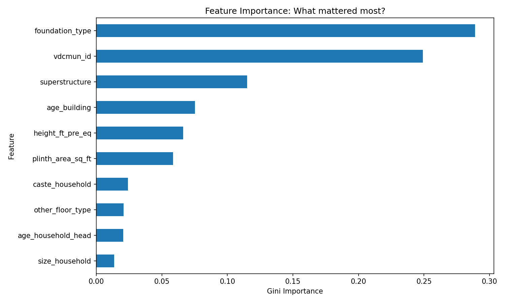
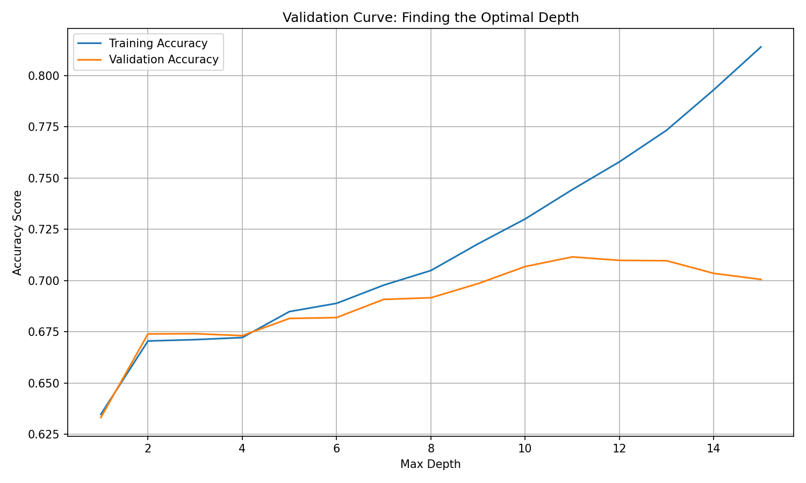

# 🇳🇵 Nepal Earthquake Severity Prediction

## 📖 Project Overview
In 2015, a massive earthquake struck Nepal, destroying thousands of structures. This project analyzes a database of building characteristics (like foundation type, roof material, and location) to predict the level of damage a building sustained.

**Goal:** Build a machine learning classification model to predict if a building suffered **severe damage** (Grade 4 or 5) vs. minor damage. This helps in understanding which construction practices are most dangerous in seismic zones.

## 💾 The Data
The data comes from the `nepal.sqlite` database, containing four main tables:
* **`id_map`**: Links household IDs to building IDs and location (`vdcmun_id`).
* **`building_structure`**: Physical details (foundation type, roof type, height, age).
* **`household_demographics`**: Information about the people living in the building.
* **`building_damage`**: The target variable (damage grade).

*Note: This analysis focuses specifically on **District 3**.*

## 🛠️ Tech Stack
* **Language:** Python 3.9+
* **Data Manipulation:** Pandas, SQL (JupySQL/SQLite)
* **Visualization:** Matplotlib, Seaborn
* **Machine Learning:** Scikit-Learn (Logistic Regression, Decision Trees)

## ⚙️ Methodology & Workflow

### 1. Data Wrangling (SQL + Pandas)
* Connected to the SQLite database using Python.
* Wrote a SQL query to join the 4 tables and filter for **District 3**.
* **Feature Engineering:**
    * Converted the target `damage_grade` into a binary classification: `Severe` (1) vs. `Not Severe` (0).
    * Addressed multicollinearity by checking correlation heatmaps (e.g., Building Height vs. Plinth Area).
    * Dropped "leaky" columns (features that would only be known *after* the earthquake, like `post_eq` recovery steps).

### 2. Exploratory Data Analysis (EDA)
We visualized the relationships between building features and damage:
* **Boxplots:** Showed that building height and footprint size were not strong standalone predictors.
* **Pivot Tables & Bar Charts:** Revealed that **Foundation Type** and **Roof Type** were critical.
    * *Insight:* "Mud Mortar-Stone" foundations had a severe damage rate of >60%, while "Reinforced Concrete" was <1%.

### 3. Model Building
We compared two different approaches:
* **Baseline:** A simple majority-class guess gave an accuracy of **54.7%**.
* **Model 1: Logistic Regression:**
    * Linear approach.
    * **Test Accuracy:** **67.0%**
    * **Insight:** Used "Odds Ratios" to identify that stone/mud structures increased risk by >3x.
* **Model 2: Decision Tree Classifier:**
    * Non-linear approach capable of complex logic.
    * **Hyperparameter Tuning:** Tuned `max_depth` to find the optimal complexity (Depth 11) to prevent overfitting.
    * **Test Accuracy:** **71.2%**
    * **Winner:** The Decision Tree beat the baseline by over **16 percentage points**.

## 📊 Key Results
| Model | Training Accuracy | Test Accuracy |
| :--- | :--- | :--- |
| **Baseline** | N/A | 54.7% |
| **Logistic Regression** | 67.4% | 67.0% |
| **Decision Tree** | **74.4%** | **71.2%** |

## 🚀 How to Run This Project
1.  **Clone the Repo:**
    ```bash
    git clone [https://github.com/YOUR_USERNAME/nepal-earthquake-prediction.git](https://github.com/YOUR_USERNAME/nepal-earthquake-prediction.git)
    ```
2.  **Install Dependencies:**
    ```bash
    pip install -r requirements.txt
    ```
3.  **Run the Notebook:**
    Launch Jupyter Lab or Notebook and open `earthquake_prediction.ipynb`.

## 🧠 Lessons Learned
* **Feature Selection:** Physical engineering features (Foundation, Roof) are far more predictive of damage than demographic features (Caste, Family Size).
* **Leakage:** It is critical to remove post-event data (like reconstruction costs) to prevent the model from "cheating."
* **Model Complexity:** A simple Decision Tree outperformed Logistic Regression because the relationship between materials and damage is non-linear (e.g., a heavy roof is fine *if* the foundation is strong).
## 📈 Visualizations

<p align="center">
  
  <br>
  <em>Figure 1: Foundation Type and Location were the strongest predictors of damage.</em>
</p>

<p align="center">
  
  <br>
  <em>Figure 2: Tuning the model depth to prevent overfitting.</em>
</p>
